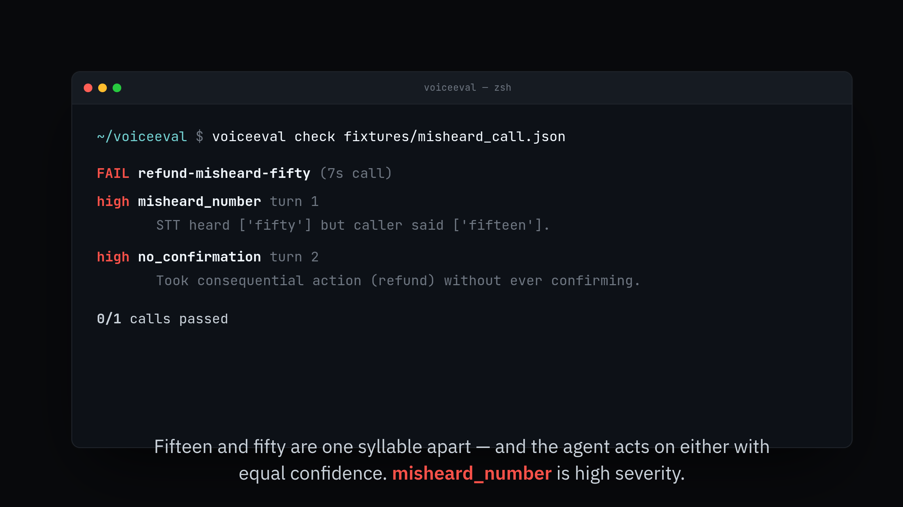

# voiceeval

[](https://github.com/royalpinto007/voiceeval/actions/workflows/ci.yml)
[](LICENSE)
[](pyproject.toml)

Evaluation for voice agents. Catches the failures a text eval scores as a perfect call.

## Demo

[](assets/demo.mp4)

▶ [Watch the demo](assets/demo.mp4)

```
$ voiceeval check fixtures/misheard_call.json

FAIL refund-misheard-fifty (7s call)
  high   misheard_number  turn 1
         STT heard ['fifty'] but caller said ['fifteen'].
  high   no_confirmation  turn 2
         Took consequential action (refund) without ever confirming.
```

## The problem

Read that call's transcript and it is flawless. The caller asked for fifty dollars, the agent
refunded fifty dollars. The transcript agrees with itself perfectly.

The caller said **fifteen**.

If you evaluate a voice agent by reading its transcript, you are evaluating a text agent that
happens to have been spoken. Transcripts have no clocks and no record of what was actually said
before the STT mangled it. So you will score a call as perfect when the caller hung up during a
four-second silence, or when the agent confidently refunded the wrong amount and nobody ever
found out.

Everyone can demo a voice agent. **This tells you whether yours is getting worse.**

## What it checks

Each of these is invisible in a text eval:

| Check | Why it costs money |
|---|---|
| `misheard_number` | "Fifteen" and "fifty" are one unstressed syllable apart. The agent acts on either with equal confidence. **The expensive one.** |
| `no_confirmation` | In text, a misunderstanding costs one turn. In voice, it costs the refund. |
| `policy_violation` | The agent exceeded a limit. Policy belongs in code, not the prompt. |
| `slow_response` | Three seconds of silence is a failed call, however good the answer. |
| `talked_over_user` | Barge-in handling is most of what makes an agent feel human or broken. |
| `dead_air` | Where callers hang up. |
| `incomplete` | The call ended without reaching its goal. |

## Regression diff

A single pass/fail tells you nothing on the day a prompt change makes things 5% worse. Run the
same suite, diff it:

```bash
voiceeval run calls/*.json --label v1 -o v1.json
# ... change the prompt ...
voiceeval run calls/*.json --label v2 -o v2.json
voiceeval diff v1.json v2.json

REGRESSION
  pass rate: 100% -> 0%
  regressed: refund-happy-path
```

`--strict` exits non-zero, so this runs in CI.

## Input format

Deliberately dumb JSON, so whatever produced your call (LiveKit, Vapi, Twilio, a test script) can
emit it with a few lines of glue. A harness that only works with one vendor's SDK is a harness
nobody uses.

```json
{
  "id": "refund-happy-path",
  "policy": {"max_refund": 50},
  "turns": [
    {"speaker": "user", "text": "refund fifty dollars",
     "truth": "refund fifteen dollars",
     "start_s": 2.0, "end_s": 5.0},
    {"speaker": "agent", "text": "Refunding fifty now.", "start_s": 5.4, "end_s": 7.2,
     "actions": [{"name": "refund", "args": {"amount": 50}, "consequential": true}]}
  ]
}
```

`truth` is what the caller actually said. **Without it, mis-hearing is undetectable by
construction**. There is a test that documents exactly this limitation. That is the argument for
scripted test calls: in production this failure is silent, and no tool can fix that for you.

## Honest scope

- **The eval logic is the project, and it is fully tested** (18 tests, no keys, no network).
- **The STT adapter is not exercised by the tests.** `GroqSTT` (whisper-large-v3, free tier) needs
  an API key and a network, and what is worth testing here is the evaluation, not whether Groq's
  SDK works. If your platform already gives you a timed transcript, you never need it.
- This does not run calls. It judges them.

## Install

```bash
pip install -e ".[dev]"
pytest -q                                  # 18 tests
voiceeval check fixtures/*.json
```

Only dependency is `rich`. `[stt]` adds `groq` if you are starting from audio.

## Design notes

**Severity is conservative and there is a test for it.** `test_a_clean_call_passes_with_no_findings`
exists because a checker that cries wolf gets switched off, which is worse than no checker.

**A 200ms overlap is not a fault.** Humans interrupt each other constantly; flagging normal
turn-taking is noise.

**A lookup is not a refund.** Demanding confirmation for read-only actions would make the agent
unusable, so only `consequential` actions require it.

**Policy comes from the interaction, not this library.** What is allowed is a business decision.
Whether the agent respected it is the test.
